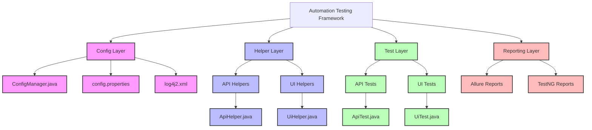
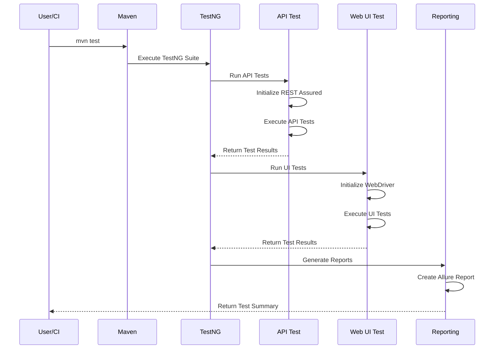

# Automation Testing Framework

Sebuah framework otomatisasi pengujian komprehensif untuk pengujian API dan UI Web yang dibangun dengan Java.

[](https://github.com/azka-art/automation-testing-framework/actions/workflows/main.yml)

## Fitur

- Pengujian API dengan REST Assured
- Pengujian UI Web dengan Selenium WebDriver
- Struktur modular dan mudah dipelihara
- Manajemen konfigurasi yang fleksibel
- Logging dengan Log4j2
- Pelaporan hasil pengujian dengan Allure
- Pengelolaan pengujian dengan TestNG
- Integrasi CI/CD dengan GitHub Actions

## Struktur Proyek

```
automation-testing-framework/
├── src/
│   ├── main/
│   │   ├── java/
│   │   │   └── com/
│   │   │       └── azka/
│   │   │           ├── api/       # Helper untuk pengujian API
│   │   │           ├── ui/        # Helper untuk pengujian UI
│   │   │           └── util/      # Utility classes
│   │   └── resources/            # File konfigurasi
│   └── test/
│       ├── java/
│       │   └── com/
│       │       └── azka/
│       │           ├── api/      # Test API
│       │           └── ui/       # Test UI
│       └── resources/           # Resource pengujian
└── .github/
    └── workflows/               # Pipeline CI/CD
```

## Visualisasi Framework

### Arsitektur Framework



### Alur Eksekusi Test



### Alur Kerja CI/CD

```mermaid
graph LR
    A[Code Push] --> B[GitHub Actions Triggered]
    B --> C[Setup JDK & Maven]
    C --> D[Build Project]
    D --> E[Run API Tests]
    E --> F[Setup Chrome]
    F --> G[Run UI Tests]
    G --> H[Generate Reports]
    H --> I[Upload Artifacts]
    
    classDef gitClass fill:#f96,stroke:#333,stroke-width:2px;
    classDef buildClass fill:#9cf,stroke:#333,stroke-width:2px;
    classDef testClass fill:#9f9,stroke:#333,stroke-width:2px;
    classDef reportClass fill:#f9f,stroke:#333,stroke-width:2px;
    
    class A,B gitClass;
    class C,D buildClass;
    class E,F,G testClass;
    class H,I reportClass;
```



## Memulai

### Prasyarat

- Java Development Kit (JDK) 21
- Maven 3.8+
- Git
- Browser (Chrome/Firefox/Edge) untuk pengujian UI

### Instalasi

1. Clone repository:
```bash
git clone https://github.com/azka-art/automation-testing-framework.git
cd automation-testing-framework
```

2. Install dependensi:
```bash
mvn clean install -DskipTests
```

### Menjalankan Pengujian

#### Menjalankan Semua Pengujian

```bash
mvn test
```

#### Menjalankan Hanya Pengujian API

```bash
mvn test -Dgroups=api
```

#### Menjalankan Hanya Pengujian UI

```bash
mvn test -Dgroups=ui
```

### Laporan Pengujian

Laporan Allure dapat dihasilkan setelah menjalankan pengujian:

```bash
mvn allure:report
```

Laporan akan tersedia di `target/site/allure-maven-plugin/`.

## Integrasi CI/CD

Framework ini terintegrasi dengan GitHub Actions untuk menjalankan otomatisasi pengujian secara berkelanjutan. Pipeline dikonfigurasi untuk:

1. Membangun proyek
2. Menjalankan pengujian API
3. Menjalankan pengujian UI dengan Chrome dalam mode headless
4. Menghasilkan laporan pengujian
5. Menyimpan laporan sebagai artifacts

Lihat file `.github/workflows/main.yml` untuk detail konfigurasi.

## Konfigurasi

Konfigurasi utama tersedia di file `src/main/resources/config.properties`:

- `api.baseUrl`: URL dasar untuk pengujian API
- `ui.baseUrl`: URL dasar untuk pengujian UI Web
- `browser`: Browser untuk pengujian UI (chrome/firefox/edge)
- `headless`: Mode headless untuk pengujian UI (true/false)
- `timeout.*`: Konfigurasi timeout

## Struktur Komponen Utama

### Config Layer

Bertanggung jawab untuk mengelola konfigurasi dan pengaturan framework:
- **ConfigManager.java** - Mengelola properti konfigurasi
- **config.properties** - Menyimpan nilai konfigurasi
- **log4j2.xml** - Mengonfigurasi logging

### Helper Layer

Menyediakan fungsionalitas umum yang digunakan oleh test:
- **ApiHelper.java** - Metode bantuan untuk API testing
- **UiHelper.java** - Abstraksi Selenium WebDriver untuk UI testing

### Test Layer

Berisi test case aktual:
- **ApiTest.java** - Test case untuk API
- **UiTest.java** - Test case untuk UI Web

### Reporting Layer

Menghasilkan laporan pengujian:
- **Allure Reports** - Laporan visual interaktif
- **TestNG Reports** - Laporan standar TestNG

## Berkontribusi

Kontribusi selalu disambut! Silakan ikuti langkah-langkah ini untuk berkontribusi:

1. Fork repository
2. Buat branch fitur (`git checkout -b feature/amazing-feature`)
3. Commit perubahan Anda (`git commit -m 'Add some amazing feature'`)
4. Push ke branch (`git push origin feature/amazing-feature`)
5. Buka Pull Request

## Lisensi

Didistribusikan di bawah Lisensi MIT. Lihat `LICENSE` untuk informasi lebih lanjut.
