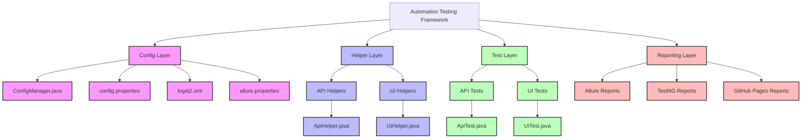
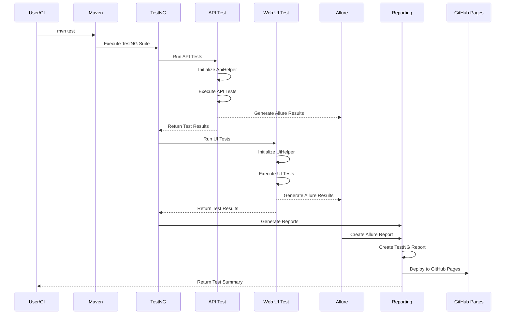
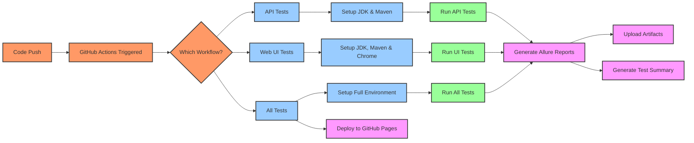

# Automation Testing Framework

Sebuah framework otomatisasi pengujian komprehensif untuk pengujian API dan UI Web yang dibangun dengan Java.

[](https://github.com/azka-art/automation-testing-framework/actions/workflows/api-tests.yml)
[](https://github.com/azka-art/automation-testing-framework/actions/workflows/web-ui-tests.yml)
[](https://github.com/azka-art/automation-testing-framework/actions/workflows/all-tests.yml)

## 🚀 Fitur

- ✅ Pengujian API dengan REST Assured
- ✅ Pengujian UI Web dengan Selenium WebDriver
- ✅ Struktur modular dan mudah dipelihara
- ✅ Manajemen konfigurasi yang fleksibel
- ✅ Logging dengan Log4j2
- ✅ Pelaporan hasil pengujian dengan Allure dan TestNG
- ✅ Pengelolaan pengujian dengan TestNG
- ✅ Integrasi CI/CD dengan GitHub Actions
- ✅ Deployment otomatis ke GitHub Pages

## 📁 Struktur Proyek

```
automation-testing-framework/
├── src/
│   ├── main/
│   │   ├── java/
│   │   │   └── com/
│   │   │       └── azka/
│   │   │           ├── api/       # Helper untuk pengujian API
│   │   │           ├── ui/        # Helper untuk pengujian UI
│   │   │           └── util/      # Utility classes
│   │   └── resources/            # File konfigurasi
│   │       ├── config.properties
│   │       └── log4j2.xml
│   └── test/
│       ├── java/
│       │   └── com/
│       │       └── azka/
│       │           ├── api/      # Test API
│       │           └── ui/       # Test UI
│       └── resources/           # Resource pengujian
│           ├── testng.xml
│           └── allure.properties
└── .github/
    └── workflows/               # Pipeline CI/CD
        ├── api-tests.yml       # Workflow untuk API tests
        ├── web-ui-tests.yml    # Workflow untuk UI tests
        ├── all-tests.yml       # Workflow gabungan dengan GitHub Pages
        └── setup-pages.yml     # Workflow untuk setup GitHub Pages
```

## 🏗️ Visualisasi Framework

### Arsitektur Framework



### Alur Eksekusi Test



### Alur Kerja CI/CD



## 🚀 Memulai

### Prasyarat

- Java Development Kit (JDK) 21
- Maven 3.8+
- Git
- Browser (Chrome/Firefox/Edge) untuk pengujian UI

### Instalasi

1. Clone repository:
```bash
git clone https://github.com/azka-art/automation-testing-framework.git
cd automation-testing-framework
```

2. Install dependensi:
```bash
mvn clean install -DskipTests
```

### Menjalankan Pengujian

#### Menjalankan Semua Pengujian

```bash
mvn test
```

#### Menjalankan Hanya Pengujian API

```bash
mvn test -Dgroups=api
```

#### Menjalankan Hanya Pengujian UI

```bash
mvn test -Dgroups=ui
```

#### Menjalankan UI Tests dengan Headless Mode

```bash
mvn test -Dgroups=ui -Dheadless=true
```

### 📊 Laporan Pengujian

#### Laporan Allure (Recommended)
```bash
# Generate dan lihat report
mvn allure:serve

# Generate report saja
mvn allure:report
```

#### Laporan Surefire (Default)
```bash
mvn surefire-report:report-only
mvn site -DgenerateReports=false
```

Laporan akan tersedia di:
- Allure: `target/site/allure-maven-plugin/index.html`
- Surefire: `target/site/surefire-report.html`

## 🔧 Konfigurasi

### File Konfigurasi Utama

#### `src/main/resources/config.properties`
```properties
# Base URLs
api.baseUrl=https://jsonplaceholder.typicode.com
ui.baseUrl=https://example.org

# Browser Configuration
browser=chrome
headless=true

# Timeouts in seconds
timeout.implicit=10
timeout.explicit=30
timeout.pageLoad=60

# API Keys (if needed)
api.key=YOUR_API_KEY_HERE
```

#### `src/test/resources/allure.properties`
```properties
allure.results.directory=target/allure-results
allure.link.issue.pattern=https://github.com/azka-art/automation-testing-framework/issues/{}
allure.link.tms.pattern=https://github.com/azka-art/automation-testing-framework/issues/{}
```

#### `src/test/resources/testng.xml`
```xml
<?xml version="1.0" encoding="UTF-8"?>
<!DOCTYPE suite SYSTEM "https://testng.org/testng-1.0.dtd">
<suite name="Automation Testing Suite">
    <listeners>
        <listener class-name="io.qameta.allure.testng.AllureTestNg"/>
    </listeners>
    <test name="All Tests">
        <packages>
            <package name="com.azka.*"/>
        </packages>
    </test>
</suite>
```

## 🚦 Integrasi CI/CD

Framework ini terintegrasi dengan GitHub Actions untuk menjalankan otomatisasi pengujian secara berkelanjutan. Terdapat 4 workflow yang tersedia:

### 1. API Tests Workflow (`api-tests.yml`)
- Menjalankan hanya pengujian API
- Trigger pada setiap push dan pull request
- Upload test results sebagai artifacts
- Generate Allure reports
- Deploy report ke GitHub Pages di folder `api-tests/`

### 2. Web UI Tests Workflow (`web-ui-tests.yml`)
- Menjalankan hanya pengujian UI Web
- Setup Chrome untuk headless testing
- Upload test results sebagai artifacts
- Generate Allure reports
- Deploy report ke GitHub Pages di folder `web-ui-tests/`

### 3. All Tests Workflow (`all-tests.yml`)
- Menjalankan semua pengujian (API + UI)
- Deploy hasil test ke GitHub Pages (hanya di branch main)
- Membuat combined report dengan navigasi

### 4. Setup Pages Workflow (`setup-pages.yml`)
- Initialize GitHub Pages branch
- Setup awal untuk deployment
- Trigger manual atau pada push ke main

## 🌐 GitHub Pages Setup

Reports dapat diakses di: `https://azka-art.github.io/automation-testing-framework/`

### Update Repository Settings

1. **Update Workflow Permissions**:
   - Repository Settings → Actions → General
   - Under "Workflow permissions", pilih "Read and write permissions"
   - Check "Allow GitHub Actions to create and approve pull requests"
   - Click Save

2. **Enable GitHub Pages**:
   - Repository Settings → Pages
   - Source: Deploy from a branch
   - Branch: gh-pages
   - Folder: / (root)
   - Click Save

### Struktur Report di GitHub Pages

```
https://azka-art.github.io/automation-testing-framework/
├── api-tests/          # Report untuk API tests
├── web-ui-tests/       # Report untuk UI tests
└── index.html          # Main navigation page
```

## 📈 Test Coverage

### API Tests (4 tests)
- `testGetUserById`: GET user berdasarkan ID
- `testGetAllUsers`: GET semua users
- `testCreatePost`: POST create new post
- `testUpdatePost`: PUT update existing post

### UI Tests (4 tests)
- `testNavigationToExampleDomain`: Navigasi ke halaman
- `testExampleLinks`: Verifikasi links
- `testPageContent`: Verifikasi content halaman
- `testPageStructure`: Verifikasi struktur halaman

## 🏛️ Struktur Komponen Utama

### Config Layer

Bertanggung jawab untuk mengelola konfigurasi dan pengaturan framework:
- **ConfigManager.java** - Mengelola properti konfigurasi
- **config.properties** - Menyimpan nilai konfigurasi
- **log4j2.xml** - Mengonfigurasi logging
- **allure.properties** - Konfigurasi Allure report

### Helper Layer

Menyediakan fungsionalitas umum yang digunakan oleh test:
- **ApiHelper.java** - Metode bantuan untuk API testing dengan REST Assured
- **UiHelper.java** - Abstraksi Selenium WebDriver untuk UI testing

### Test Layer

Berisi test case aktual dengan anotasi TestNG dan Allure:
- **ApiTest.java** - Test case untuk API (4 tests) dengan Allure annotations
- **UiTest.java** - Test case untuk UI Web (4 tests) dengan Allure annotations

### Reporting Layer

Menghasilkan laporan pengujian:
- **Allure Reports** - Laporan visual interaktif dengan charts dan timeline
- **TestNG Reports** - Laporan standar TestNG dalam format HTML
- **GitHub Pages** - Publikasi report online yang dapat diakses publik

## 🐛 Troubleshooting

### Allure Report Issues
Jika Allure report tidak tergenerate:
1. Pastikan `allure.properties` ada di `src/test/resources/`
2. Cek TestNG listener di `testng.xml`
3. Verify Maven plugin configuration di `pom.xml`
4. Run dengan: `mvn clean test -Dallure.results.directory=target/allure-results`

### CDP Version Warning
Jika muncul warning tentang CDP version saat menjalankan UI tests:
```
WARNING: Unable to find CDP implementation matching X
```
Ini adalah warning normal dan tidak mempengaruhi eksekusi test. CDP (Chrome DevTools Protocol) digunakan untuk fitur advanced yang tidak diperlukan untuk test dasar.

### Headless Mode Issues
Jika test gagal di headless mode, coba:
1. Update Chrome/ChromeDriver ke versi terbaru
2. Tambahkan arguments tambahan di ChromeOptions
3. Periksa log untuk error spesifik

### GitHub Pages Deployment Issues
Jika deployment ke GitHub Pages gagal:
1. Pastikan workflow permissions sudah diset ke "Read and write"
2. Check apakah branch `gh-pages` sudah dibuat
3. Verify repository settings untuk GitHub Pages sudah benar
4. Re-run workflow setelah fix permissions

## 🤝 Berkontribusi

Kontribusi selalu disambut! Silakan ikuti langkah-langkah ini untuk berkontribusi:

1. Fork repository
2. Buat branch fitur (`git checkout -b feature/amazing-feature`)
3. Commit perubahan Anda (`git commit -m 'Add some amazing feature'`)
4. Push ke branch (`git push origin feature/amazing-feature`)
5. Buka Pull Request

### Commit Message Guidelines
Gunakan conventional commits format:
- `feat:` untuk fitur baru
- `fix:` untuk bug fixes
- `docs:` untuk perubahan dokumentasi
- `test:` untuk perubahan testing
- `refactor:` untuk code refactoring
- `chore:` untuk maintenance tasks

## 📝 Lisensi

Didistribusikan di bawah Lisensi MIT. Lihat `LICENSE` untuk informasi lebih lanjut.

## 📧 Kontak

Azka Nur Fathoni - [@azka-art](https://github.com/azka-art)

Project Link: [https://github.com/azka-art/automation-testing-framework](https://github.com/azka-art/automation-testing-framework)

## 🙏 Acknowledgments

- [REST Assured](https://rest-assured.io/) - API Testing Framework
- [Selenium WebDriver](https://www.selenium.dev/) - UI Testing Framework
- [TestNG](https://testng.org/) - Test Framework
- [Allure](https://docs.qameta.io/allure/) - Test Reporting
- [GitHub Actions](https://github.com/features/actions) - CI/CD Platform
- [GitHub Pages](https://pages.github.com/) - Static Site Hosting